# Eduardo Valerin

## Acerca de mi
Soy un estudiante de sexto semestre en la carrera de Ingeniero en Tecnologías Computacionales en el Tecnológico de Monterrey, originario de Honduras y actualmente estudiando en México. Mi interés por la tecnología me ha llevado a enfocarme en dos áreas: la ciberseguridad y el desarrollo de software.

En mi trayectoria académica he adquirido habilidades y conocimientos en programación, bases de datos, redes de computadoras y seguridad informática. Me apasiona aprender sobre nuevas tecnologías y estar a la vanguardia de las últimas tendencias en el ámbito de la informática.

Mi objetivo profesional es desarrollarme como un experto en ciberseguridad y contribuir a la protección de los sistemas y datos de empresas y usuarios. También me interesa el desarrollo de software, especialmente en la creación de sistemas, programas y aplicaciones que resuelvan problemas reales y mejoren la experiencia de los usuarios.

## Proyectos
### App Prodan
Aplicación movil para la organización Prodan la cual permite y facilita a los usuarios el poder postularse como casas temporales para el animal que ellos seleccionen, haciendo que estos puedan revisar la solicitud a traves de Google Forms. La aplicación fue desarrollada en Android Studio, ademas de contar con una página web donde los administradores de la organización pueden dar de alta o de baja distintos animales.

  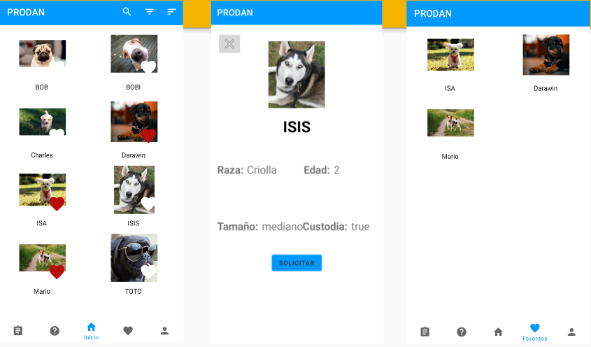
  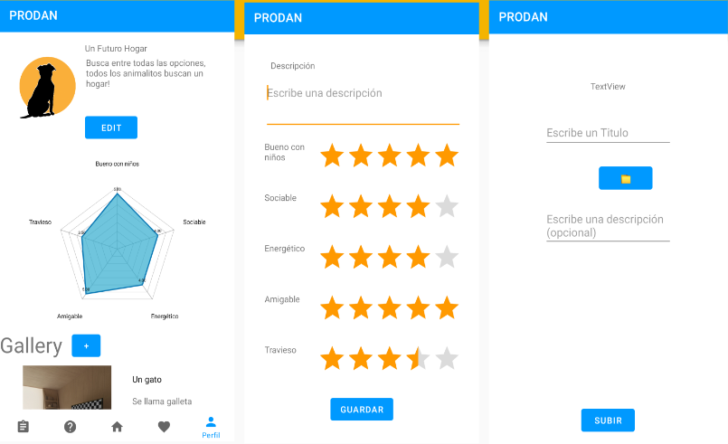
  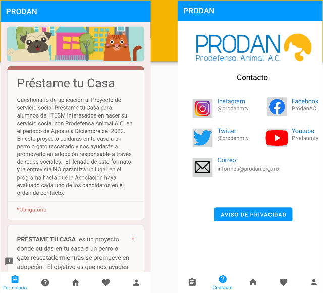
  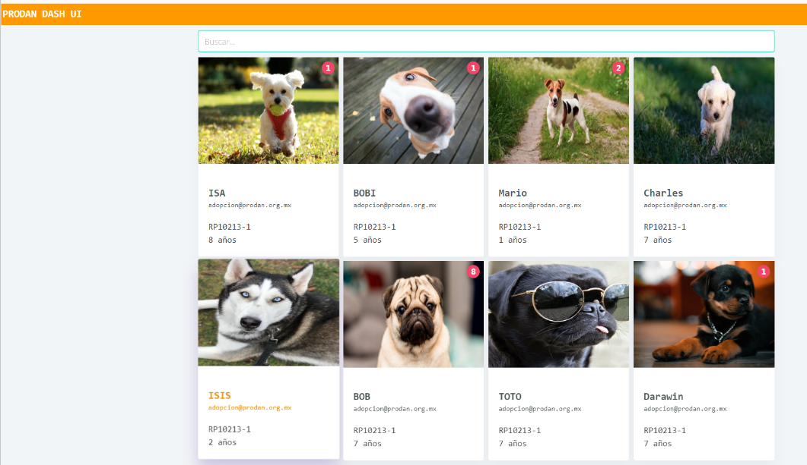
  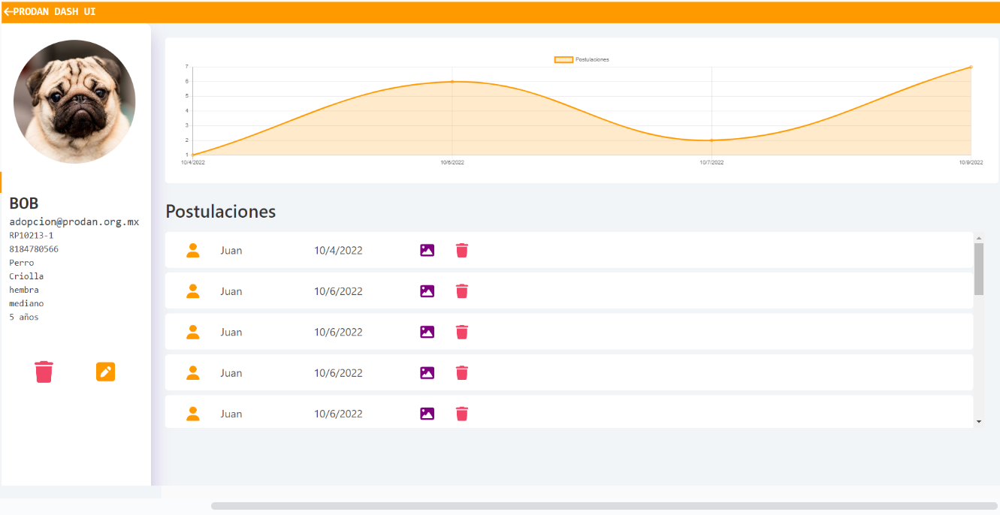

Video de presentación: https://www.youtube.com/watch?v=TbRKnSdQoXs

### Infraestructura de Red Completa
Desarrollo de una diseño completo de infraestructura de red en Cisco Packet Tracer para una empresa mediana en la cual se creó una tabla en Excel con las direcciones IP generadas después de subnetear con VLSM una red de clase C, se protegió la consola de línea, se aseguró el acceso EXEC del usuario con una contraseña para cada enrutador y switch y se establecieron servicios DHCP y VLANs para cada router.

  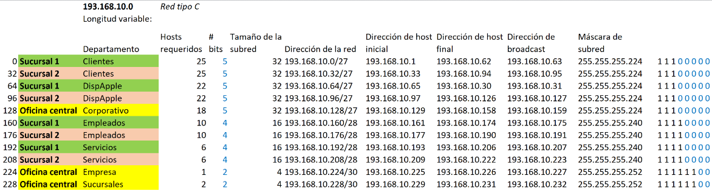
  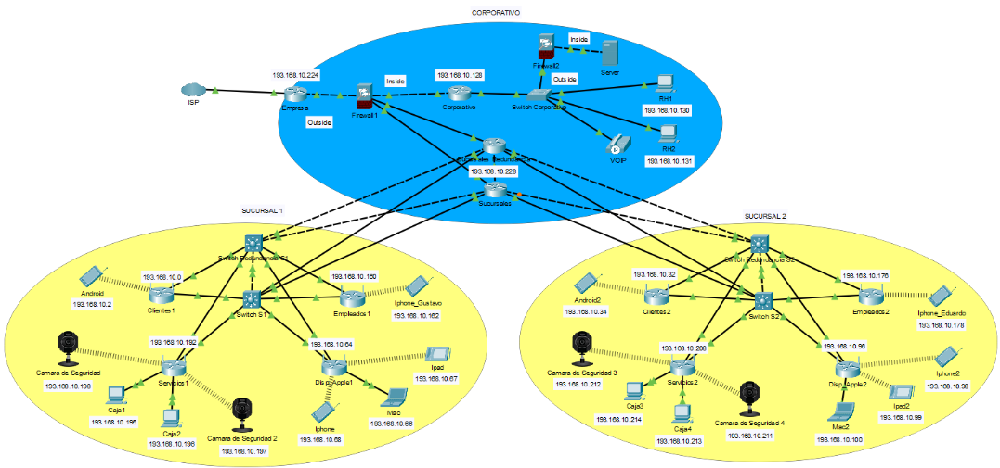
  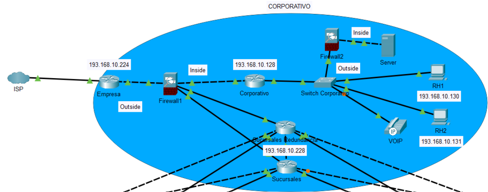
  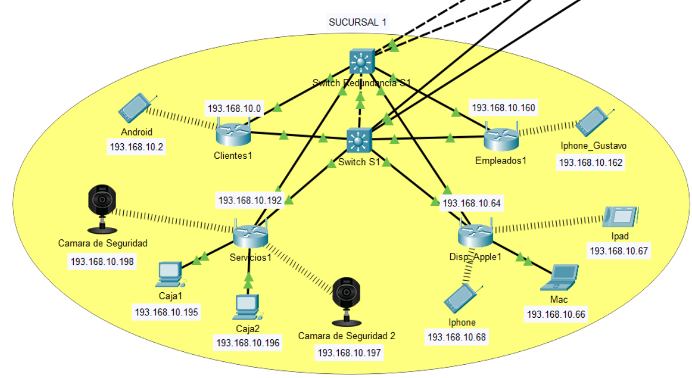
  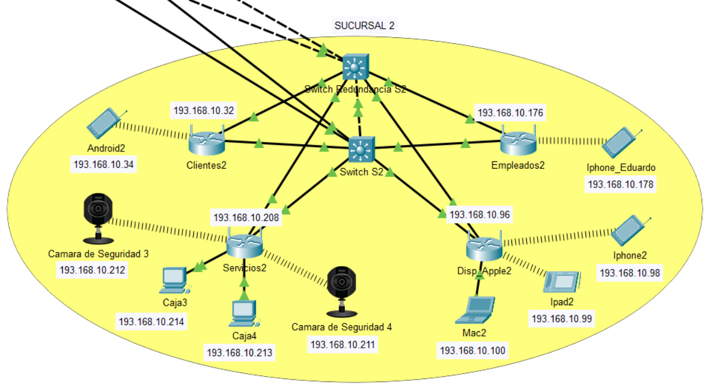

Video de presentación: https://www.youtube.com/watch?v=K8sB1rZ6Zm8

### Juegos Python
Desarrollo de 3 minijuegos en Python utilizando la librería turtle y freegames, los cuales se componen por:
Una imitación de paint donde se pueden crear distintas figuras como circulos, rectangulos y triangulos
Un juego de snake donde se destaca que la manzana que se debe comer el snake se mueve cada cierto tiempo, además de que cuando este se come la manzana este crece y una nueva manzana hace spawn aleatoriamente en alguna parte del mapa
Una aplicación de memorama que contiene una lista de carros, en la cual se debe encontrar su respectivo par para cada vehículo para poder ganar

  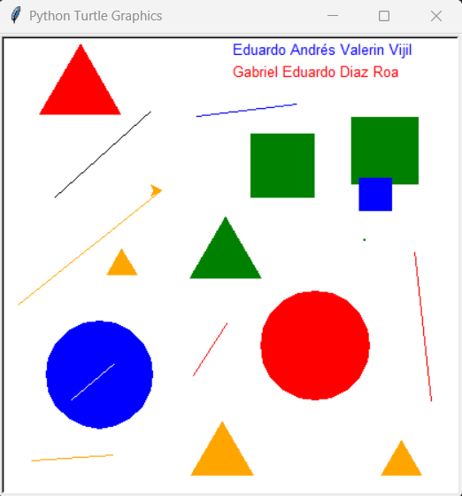
  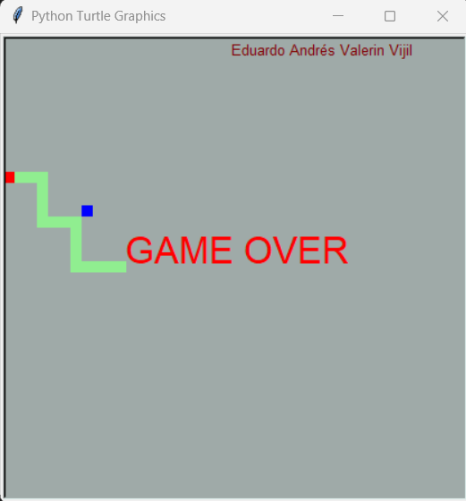
  
  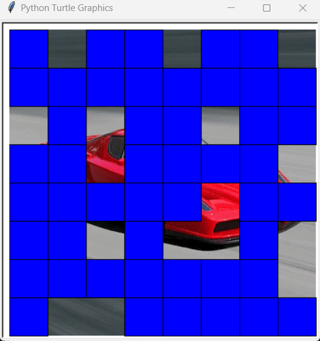
  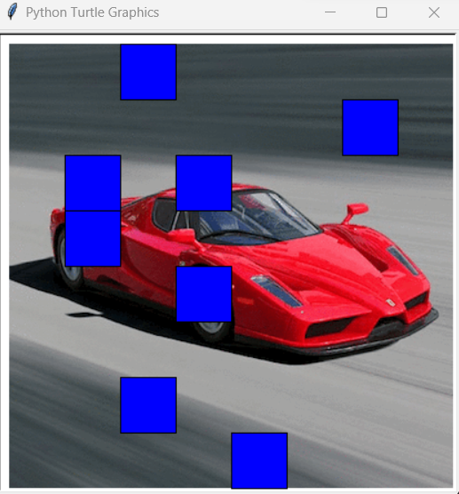
  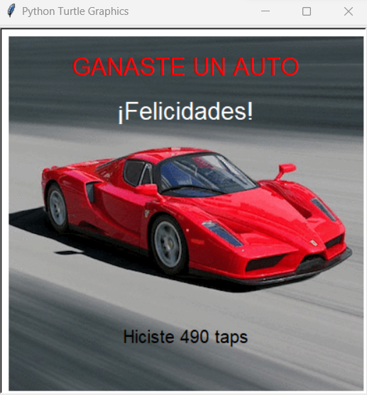

### Multiagentes Unity
Proyecto desarrollado en Unity y haciendo uso de python (multiagentes) cuya función es servir como una propuesta para reducir el trafico en una intersección vehicular haciendo uso de semaforos inteligentes, los cuales hacen que el trafico vehicular fluya de mejor manera en comparación a los semáforos tradicionales. Para esto se realizo la lógica de los vehículos y de los semaforos en Python, para después implementarlo en un proyecto de Unity donde se crearon distintos vehículos, edificios, semáforos y otros detalles para dar ambiente a la situación presentada

  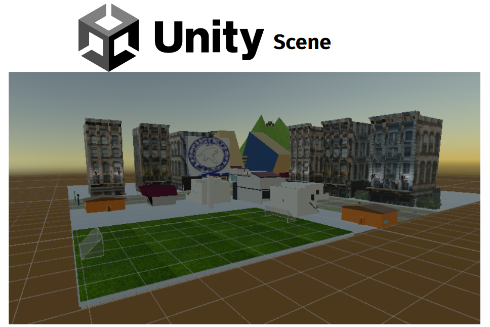
  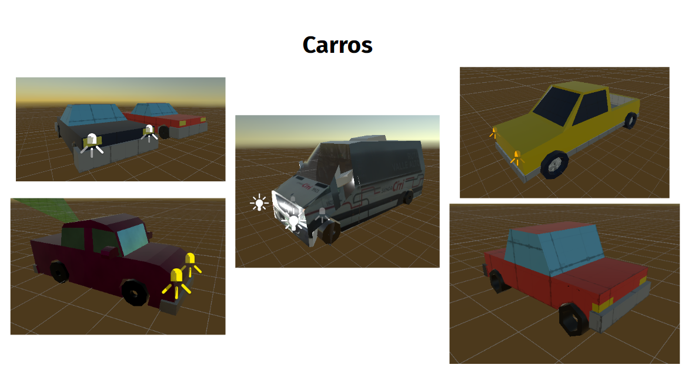
  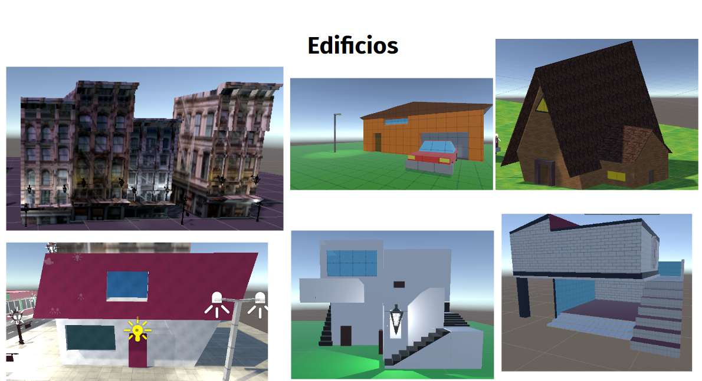
  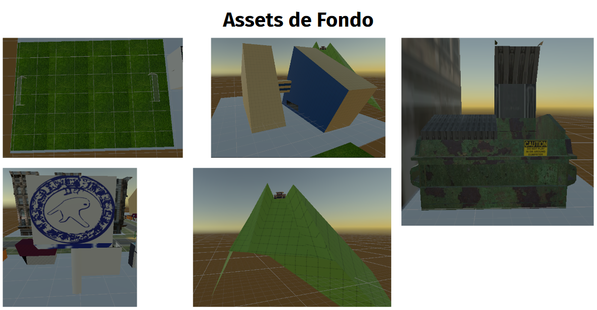
  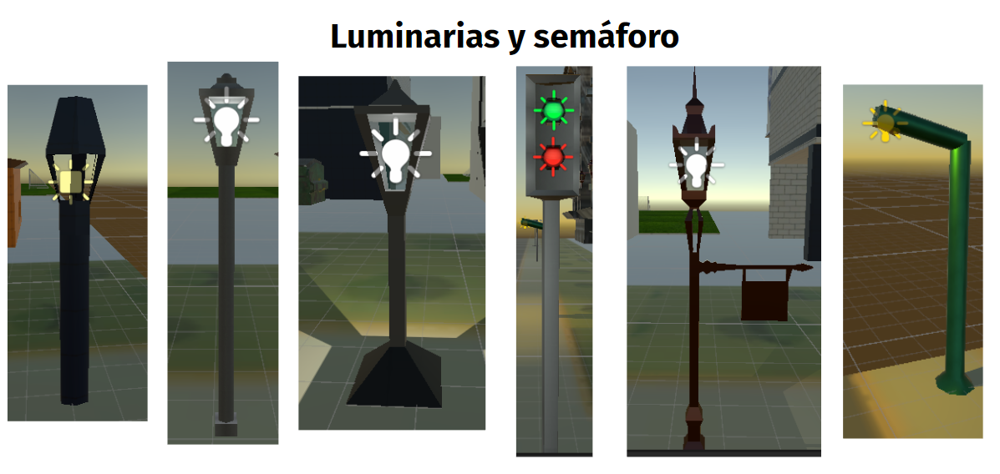

Video de simulación 1: https://www.youtube.com/watch?v=0K8liNkntnU

Video de simulación 2: https://www.youtube.com/watch?v=wm5DH0iDiZg

### Walmart Vue.js
Desarrollo de una web app en cuatro días haciendo uso de Vue.js, la cual busca ser una imitación de la página de Walmart, en la cual se despliegan los productos disponibles con su precio, además de permitir al usuario poder agregar los productos deseados al carrito de compras. Adicionalmente, cuenta con una página de log in para que el usuario pueda mantener guardado su carrito, si el usuario no tiene una cuenta este no podrá guardar sus items en el carrito.
